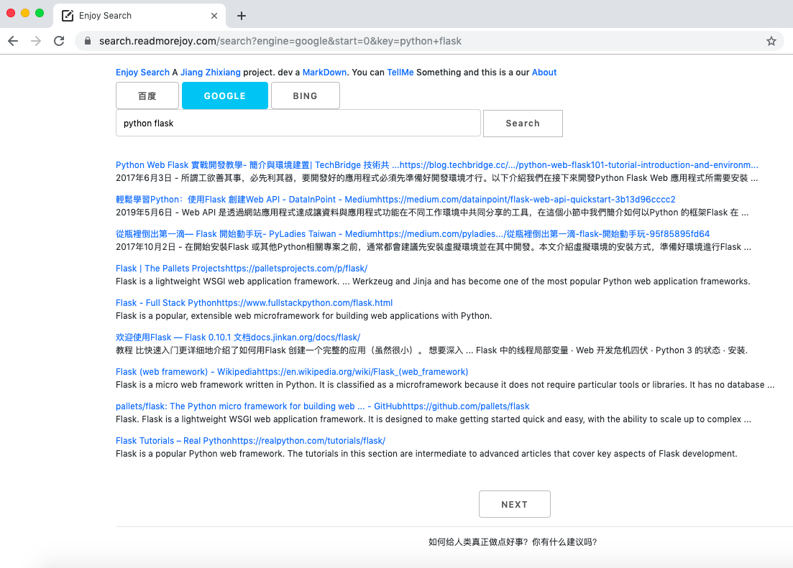

# Enjoy Search

开发一个搜素引擎工具，目标是，获取到更优质信息，欢迎试用。

当前提供 Google，Bing，百度 三大搜素引擎，还在研究增加更多资源，尽请期待！

MarkDown工具：请填写文章的URL地址，自动获取和转换成MarkDown格式。

TellMe菜单：方便您给我们留言的窗口，有需要回复，可以留下您的联系方式。

About菜单：EnjoySearch工具的介绍信息。

发展：希望能多学习 duckduckgo 搜索技术

最近：希望能抽出时间，增加若干国内搜索引擎

运营URL，也许你会喜欢上她，极简、高效、实用。还需要推出 搜索教程 帮助您。

https://search.readmorejoy.com/

For running this search engine server:
* If you need google, your server can use google server.
* If you need Bing, your need bing search key get from microsoft.
